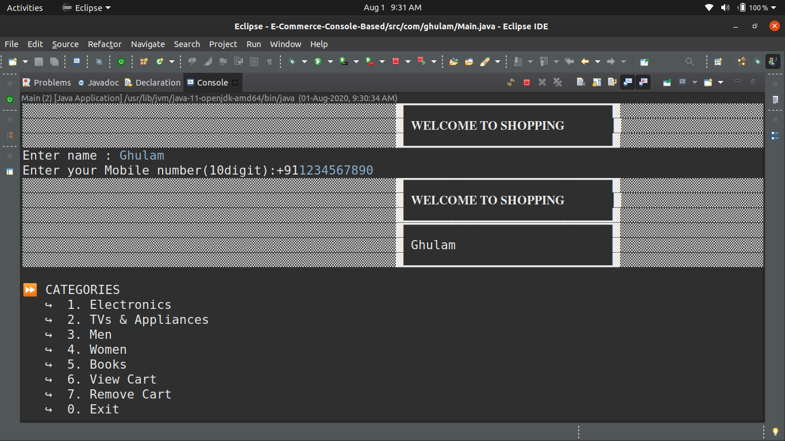
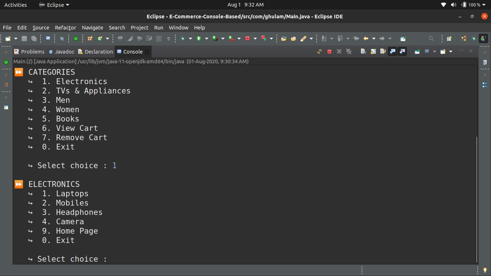
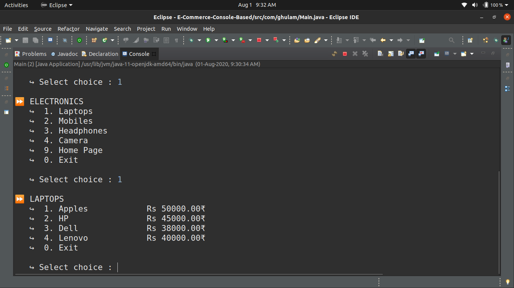
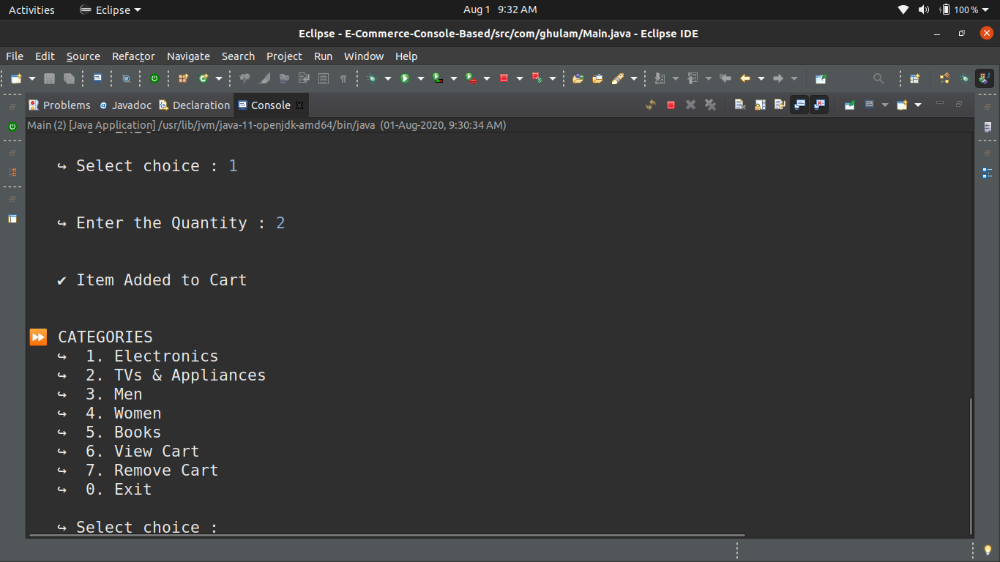
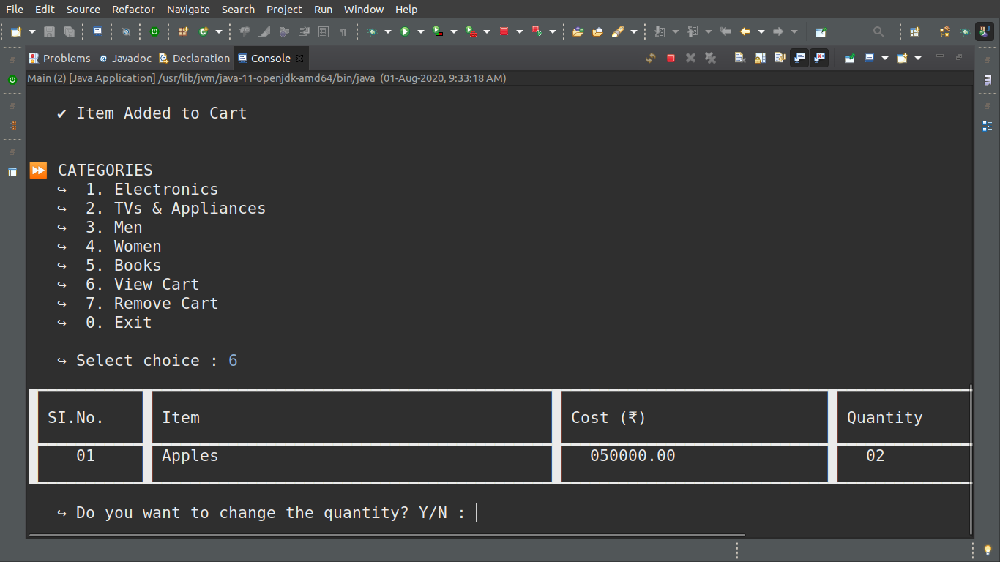
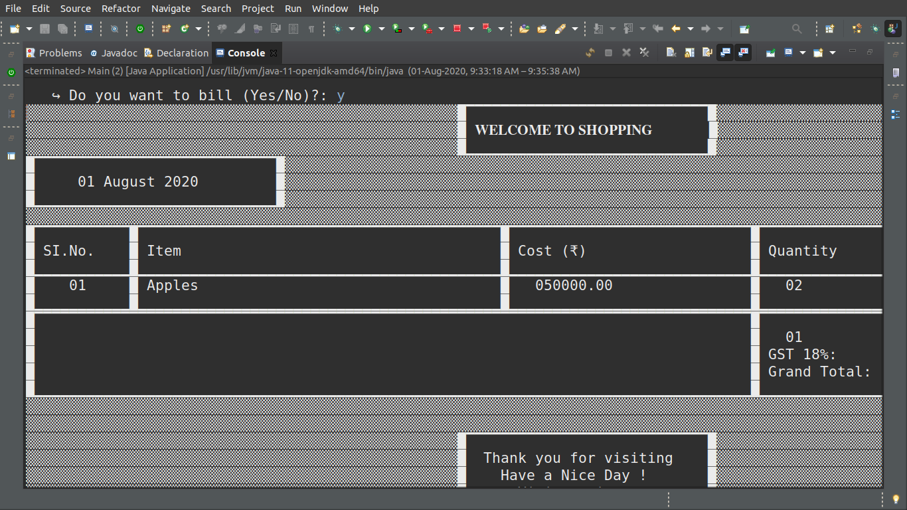

# Customizable_product_store

## Overview
This is a console-based application that allows users to customize and purchase products. Users can select products, apply customizations, manage their shopping cart, and generate a receipt.

## Features
- Browse and customize products (color, design, text).
- Add products to the shopping cart and view totals.
- Save and load cart data.
- Search, filter, and sort products.
- Receipt generation.

## Architecture
- *Product*: Represents the customizable products.
- *Cart*: Manages items and calculates totals.
- *ValidationUtils*: Provides validation for inputs.
- *User*: Represents the user interacting with the store.

## How to Run
1. Install Java (version 8 or higher).
2. Compile the project:
   ```bash
   javac -d bin src/com/ghulam/*.java


It's build on Core Java

**Tools: Eclipse**

## ScreenShot







